# Set up of Cognos Analytics 11.1 with DB2-C and Cloudera quickstart on Docker Compose
---
## Example of Dockerfile to setup Cognos 11.1 in a container
__WARNING__: The resulting docker image is not suitable for any production use and should be used for demonstration purposes only

## Copyright 2019, IBM Corporation

Unless required by applicable law or agreed to in writing, software distributed under the License is distributed on an "AS IS" BASIS, WITHOUT WARRANTIES OR CONDITIONS OF ANY KIND, either express or implied.
See the License for the specific language governing permissions and limitations under the License.

Written by Philippe Gregoire - IBM Ecosystem Advocacy Group Europe (philippe.gregoire@fr.ibm.com)

---

## Overview
This Docker image build on top of the Cognos 11.1/Centos 7 with DB2-developer-C image, and adds Cloudera QuickStart to it.

<a name="prereqs"></a>__Prerequisites__:
 - Docker (with docker-compose) installed locally
   - Tested with 4 CPUs and 15GB RAM which seem to be the minimum configuration
 - See the Cognos 11.1 specific prereqs in [phg-centos7-xfce-cognos\README_Cognos_setup_docker.md](phg-centos7-xfce-cognos\README_Cognos_setup_docker.md#prereqs)
 - Access to the Cloudera Quickstart docker image

The `docker-compose.yml` file in this directory sets up the Cloudera QuickStart docker image in the same docker-compose set as Cognos Analytics 11.1

__Capacity Planning & Resource Consumption__ :
After playing a bit with the fully setup and configured images, I used `docker images` and *Portainer* to get an idea of resource consumption and got the following:

|Component|Image size|Runtime RAM|
|---|--:|---:|
|_DB2-Developer-C 11.1.4.4_|2.62 GB|883 MB|
|_Cognos Analytics 11.1_|12.2 GB|7.4 GB|
|_Cloudera QuickStart 5.13.0_|7 GB|5.4 GB|

Of course, your mileage may vary

## Setting up Cognos 11.1 docker-compose environment
See [phg-centos7-xfce-cognos\Cognos_setup_docker.md](phg-centos7-xfce-cognos/README_Cognos_setup_docker.md) for instructions to get Cognos 11.1 setup with DB2-C on docker.

## Setting up Cloudera quickstart docker
 * Download from Cloudera their quickstart docker image, see https://www.cloudera.com/downloads/quickstart_vms/5-13.html
   https://downloads.cloudera.com/demo_vm/docker/cloudera-quickstart-vm-5.13.0-0-beta-docker.tar.gz
 * Unpack image ungzip, to get the `tar`, using e.g. `7z x cloudera-quickstart-vm-5.13.0-0-beta-docker.tar.gz` 
 * Import and tag image into local Docker: `docker import cloudera-quickstart-vm-5.13.0-0-beta-docker\cloudera-quickstart-vm-5.13.0-0-beta-docker.tar cloudera/quickstart:import`
 * Verify the image using `docker images`

 * For testing purposes, you may want to start image the image stand-alone, exposing ports 80, 8888, 7180: `docker run --name clouderaqs --hostname=quickstart.cloudera --privileged=true -p 8888:8888 -p 7180:7180 -p 80:80 -td cloudera/quickstart:import /bin/bash -c "/usr/bin/docker-quickstart && /bin/bash"`
 * Tail the log using `docker logs -f clouderaqs`
 * Ports used by the image: 
   * 80: Welcome
   * 8888: Hue
   * 7180: ?
   * 12000/12001: sqoop
   * 11000/11001/11443: oozie
* Once started, you should get the Cloudera welcome page on HTTP port 80 http://localhost, from there you can link the Hue interface at http://localhost:8888 (user `cloudera`, pw: _cloudera_)
  * Stop and remove the container with `docker stop clouderaqs` and `docker rm clouderaqs`

## Running the docker-compose assembly
To start all 3 containers in one go:
* Follow above instructions to getting the DB2-developer-C image, the Cloudera-QuickStart image and the Cognos Analytics 11 builds
* Use `docker-compose up -d` to bring up the assembly.
* You may monitor the bring-up process with `docker-compose logs -f` or individually for each container:
  * `docker-compose logs -f db2-c` should eventually show the CM database:
  ```
  db2server       | Database 1 entry:
  db2server       |
  db2server       |  Database alias                       = CM
  db2server       |  Database name                        = CM
  ``` 
  *  `docker-compose logs -f cognosca11_1` until you get a line that reads:
  ```
  cognos11cnr     | INFO, "[main]", "Silent Execution Mode (end)"
  ```
  *  `docker-compose logs -f cloudera_qs` until:
  ```
  cloudera_qs     | Started Impala Server (impalad):[  OK  ]
  ```

## Post-installation configuration steps
After starting the docker-compose assembly, some manual configuration steps are still required

### Optional: cataloging the DB2 SAMPLE database in Cognos:
Login to Cognos Analytics web UI (http://localhost:9300) and setup a connection for the *SAMPLE* database:
* Setup DB connection for `jdbc:db2://db2server:50000/SAMPLE`:
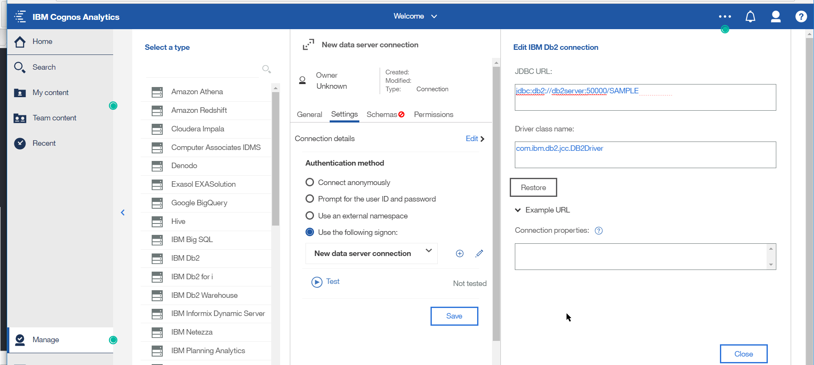
* Setup userid `db2inst1` and password _passw0rd_ 
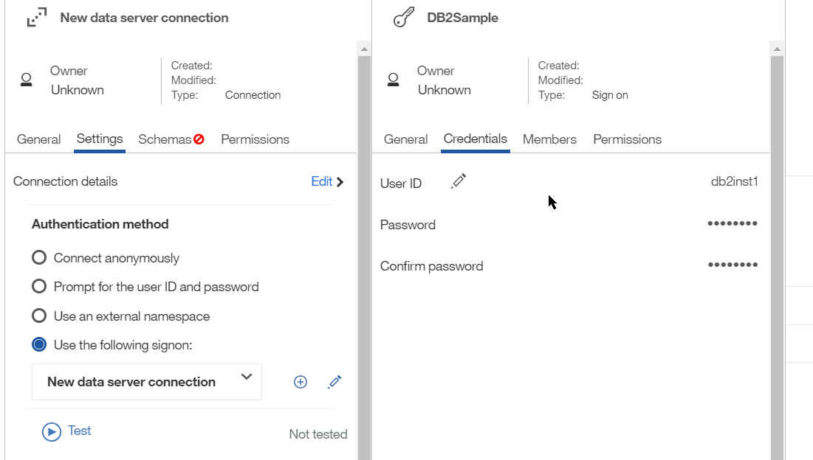
* Test connection:
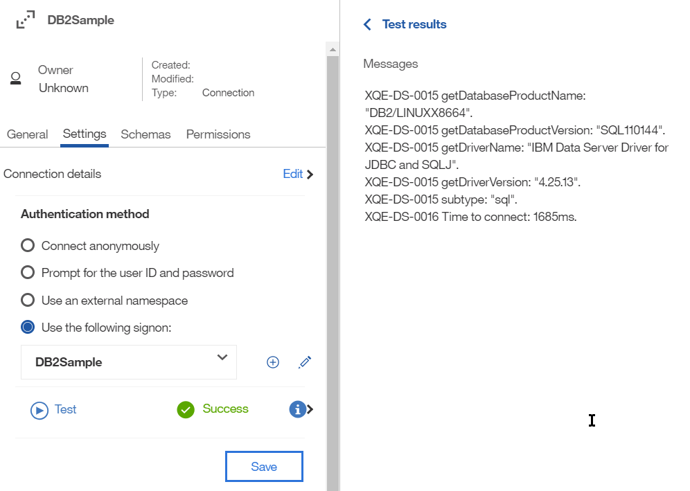
* Import schemas:
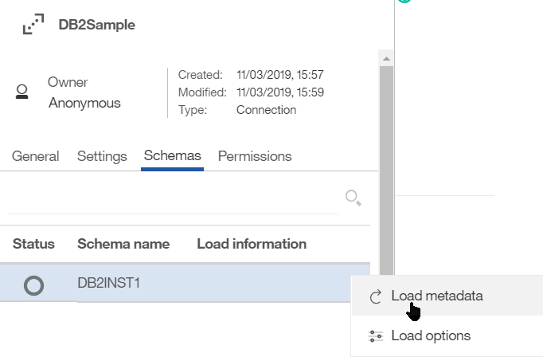
* You should get 47 tables:
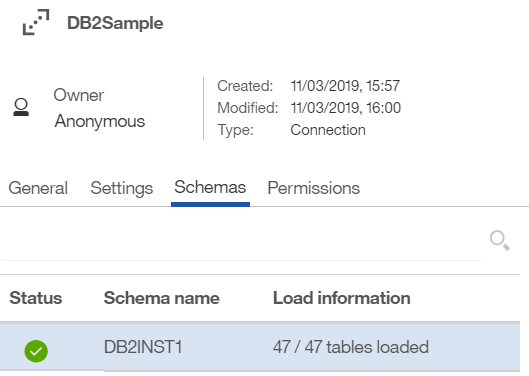

### Populating Cloudera Impala database
The Cloudera quickstart image comes with a sample dataset. This dataset is originally stored in a MySQL database which is then loaded through **sqoop** into **HDFS** in *parquet* format.

The instructions for setting up this sample dataset are part of the Cloudera quickstart image tutorial (http://localhost/#/tutorial), we will just outline the key steps here:

* Load data into Cloudera HDFS
Use the **sqoop** command from the quickstart tutorial (see http://localhost/#/tutorial/ingest_structured_data):
  ```
  sqoop import-all-tables \
  -m 1 \
  --connect jdbc:mysql://quickstart:3306/retail_db \
  --username=retail_dba \
  --password=cloudera \
  --compression-codec=snappy \
  --as-parquetfile \
  --warehouse-dir=/user/hive/warehouse \
  --hive-import
  ```
This operation takes about 8-10 minutes. To verify the loading, from a bash session `docker exec -ti cloudera_qs bash`, you can run `hadoop fs -ls /user/hive/warehouse` 
* Update Impala metadata cache
Once the tables are loaded, follow the Tutorial Exercise 1 to update Impala metadata, e.g. log into hue at http://localhost:8888/hue, switch to the **Impala** tab and execute `invalidate metadata; show tables;`

### Connecting to Cloudera through Impala
Now that Cloudera HDFS is populated with sample data and reflected in Impala metadata, we can proceed to connecting Cognos Analytics to that datasource through the Impala connector.
Note that the Cloudera JDBC 4.1 drivers must have been copied to the Cognos `drivers` folder.

References:
- https://www.cloudera.com/documentation/enterprise/5-14-x/topics/impala_ports.html
- [Create a non-kerberos JDBC Cloudera Impala datasource connection in Cognos Analytics](http://www-01.ibm.com/support/docview.wss?uid=swg22013856)

Creating a Cloudera Impala connection in Cognos Analytics:
From the Cognos Analytics web ui (http://localhost:9300), use *Manage/Data server connections* to create a new connection **(+)** of type *Cloudera Impala*: 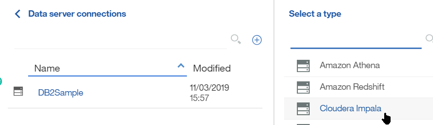
* Setup the connection details to:
  * JDBC URL: `jdbc:impala://cloudera_qs:21050/default`
  * Driver class name: `com.cloudera.impala.jdbc41.Driver`
  * Use signon userid **cloudera** and pw *cloudera*
  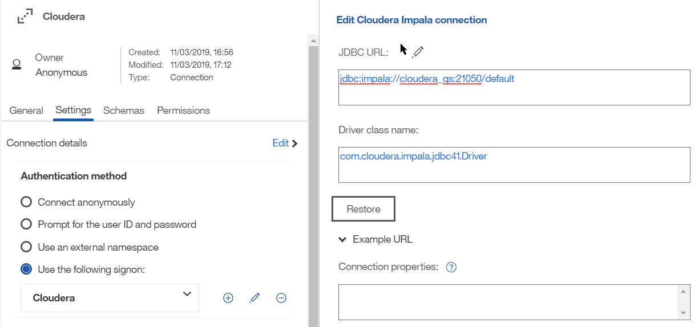
* Test the connection: 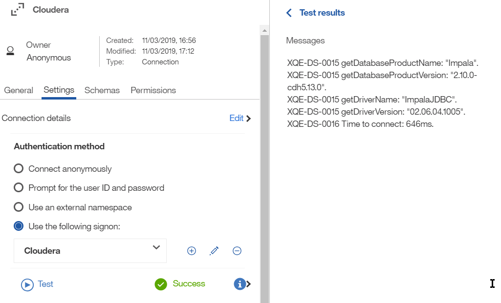
* Expand the *Schemas* tab, select **Impala/default** menu's *Load metadata* 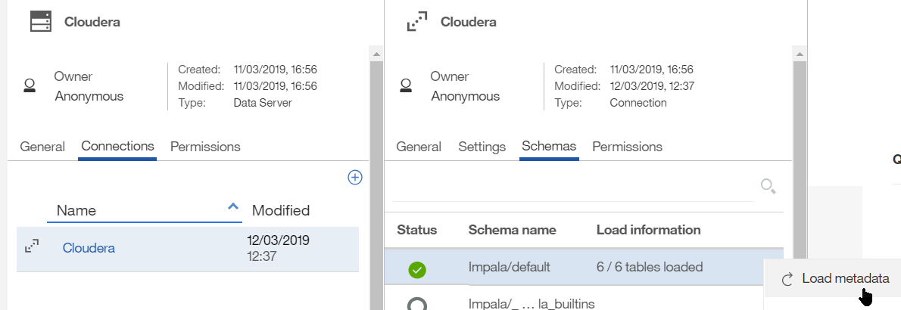
* You should get the *6/6 tables loaded* message, visible in *Load options* menu then *Tables* tab: 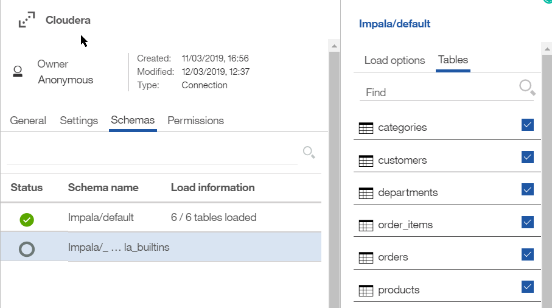

The data surfaced through this connection can then be used in *Data Modules* to built Dashboards and Reports: 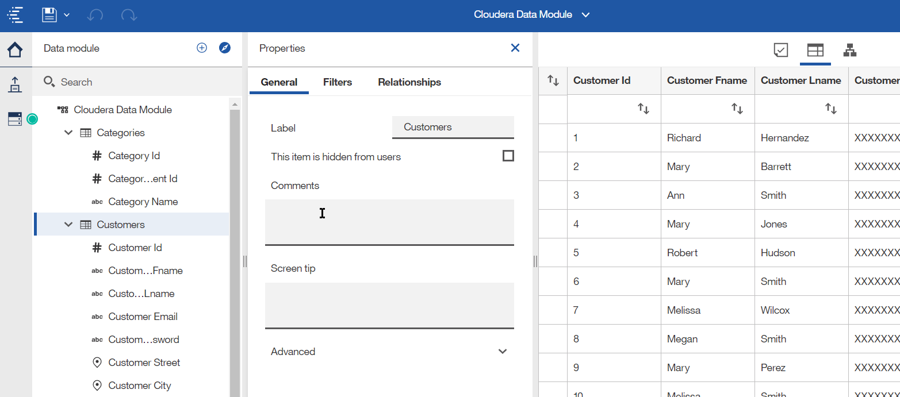
