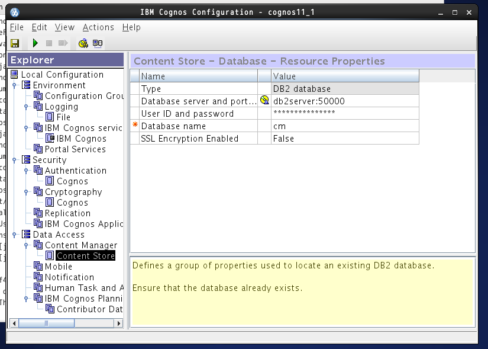

# Overview
The files in this directory pertain to setup of **Cognos 11.1** with **DB2-Developer-C**

It is built with two docker containers driven by docker-compose.
The setup uses Centos7 base linux OS image for both containers.

Some licenses for **DB2-Developer-C** and **Cognos 11.1** installation files must be obtained and are ***not*** provided in this repository. See the relevant instructions below.

### Preparation
We will use two named volumes `shared` and `db2cogdata`, to be created first:
* `docker volume create shared`
* `docker volume create db2cogdata`

## DB2 image
We will use an already dockerized version of DB2, DB2-Developer-C
* To procure DB2-C docker image, register from https://hub.docker.com/_/db2-developer-c-edition
  * You may then pull the image locally manually `docker pull store/ibmcorp/db2_developer_c:11.1.4.4-x86_64`, or just run the `docker-compose` command as below
* The DB2-C container configuration that we will use extends the provided image and is defined by a Dockefile and `docker-compose.yaml` file in the `db2-dev-c` folder
  * The persistent storage for the DB2 database requires the named volume `db2cogdata`
  * This image is built on **CentOS-7**
  * It is setup with userid `db2inst1` (pw:passw0rd)
* To start the container stand-alone, execute `docker-compose up --build -d db2-dev-c`
  * You can tail the container logs with `docker-compose logs -f`
  * Once started, you can check which databases exist with `docker exec -ti db2server bash -c "su - db2inst1 -c 'db2 list db directory'"`

  Prepare for Cognos 11.1 image setup:
  * Extract the db2jcc JDBC drivers from the image and place them in the `cognosca\media` directory
  ```
  docker cp db2server:/opt/ibm/db2/V11.1/java/db2jcc4.jar cognosca\media
  docker cp db2server:/opt/ibm/db2/V11.1/java/db2jcc.jar cognosca\media
  docker cp db2server:/opt/ibm/db2/V11.1/java/db2jcc_license_cu.jar cognosca\media
  ```
  * Stop the stand-alone db2-dev-c server using `docker-compose down`

# Cognos 11.1 image
The **Cognos 11.1** containerized image is built by running silent installer and unattended configuration on top of a Centos7 with VNC/xfce image obtained from DockerHub
Note that with unattended configuration, there is no actual need for VNC/xfce support.

The VNC server will expose the xfce desktop on ports `5901` (pw:vncpassword) and `6901` as VNC/HTTP (pw:vncpassword)

* Get Cognos packages from Passport advantage. You will need 2 packages, find their IDs in the `Dockerfile`, and place them into the `cognosca\media` directory.
* Ensure that `cognosca\media` also has the 3 `db2jcc*` files from DB2-C installation above, and optionally the Cloudera Impala JDBC driver file (if not, comment out the line in the `Dockerfile`)

* To build the image using docker-compose run `docker-compose build cognosca`

# Start the two containers using docker-compose and the provided docker-compose.
Once the two images have been provisionned and built, we can run the assembly using `docker-compose`
* To bring up the two images making sure builds are up to date execute `docker-compose up --build -d`
* To follow build-up time, tail the logs: `docker-compose logs -f`

**Note** that the Cognos unattended configuration requires that the DB2 engine is running and has the CM database created properly. A delay of 4 minutes has been introduced in the scripts for Cognos to wait until DB2 should be up. Depending on the hardware setup, it may be too much or not enough. This default timing of 4 minutes can be modified by setting the environment variable `COGNOS_WAIT_DB2_MINS` to another value prior to calling `docker-compose up`

The first time DB2 is brought up, it will run a script to create the CM database, and that may take longer than subsequent startups. Once setup, the DB2 database is stored permanently in the `db2cogdata` persistent volume. In case `cognos11cnr` fails to initialize you can restart it with `docker stop cognos11cnr` followed by `docker-compose up -d`.

Cognos will try to restart up to `COGNOS_MAX_RETRIES` (default 5) times.

After bring-up, the Congos UI will be available on port `9600`, which should be reflected on the host as http://localhost:9600

# Post-config Troubleshooting
The `docker-compose` assembly should bring up the two containers without further action.

If not, trouble shooting tools include:
* Tailing the logs with `docker-compose logs -f`
* Getting shells into each of the containers using:
  * `docker exec -ti db2server bash`, then `sudo su - db2inst1` to use db2inst1 user and `DB2` command. 
  * `docker exec -ti cognos11cnr bash`, Cognos installed in `/opt/ibm/cognos/analytics`
* Getting into the Cognos VM xfce desktop using VNC on port `5901`:
  * Check that the 3 `db2jcc*.jar` DB2 drivers files are present in `/opt/ibm/cognos/analytics/drivers`
  * Start the interactive configuration tool: `/opt/ibm/cognos/analytics/bin64/cogconfig.sh`
    * Verify the hostnames in Environment URI which should be `cognos11srv` 
  * Check Content Manager setup: 
    * From the *Content Store* menu, run *Generate DDL*. You get a file in `/opt/ibm/cognos/analytics/configuration/schemas/content/db2/createDb.sql`
    * Extract the file and send it to the DB2 Machine:
      ``` 
      docker cp cognos11_1:/opt/ibm/cognos/analytics/configuration/schemas/content/db2/createDb.sql .
      docker cp createDb.sql db2server:/var/db2_setup/createDb.sql
      ``` 
    * Manually create the CM database:
      `docker exec -ti db2server bash -c "su - db2inst1 -c \"db2 -tf /var/db2_setup/createDb.sql -v\""`
  * **NOTE**: You can also copy the file to the `/shared` common volume and exec the `db2 -tf` on that file, e.g.:
    * On *cognosca* `cp /opt/ibm/cognos/analytics/configuration/schemas/content/db2/createDb.sql /shared`
    * Then `docker exec -ti db2server bash -c "su - db2inst1 -c \"db2 -tf /shared/createDb.sql -v\""`
  * Start the Cognos Services using `Actions/Start` menu
  * Once started, the cognos Web UI will be available on http://localhost:9300/bi
  * To extract the Cognos config file from the container, use: `docker cp cognos11_1:/opt/ibm/cognos/analytics/configuration/cogstartup.xml .`